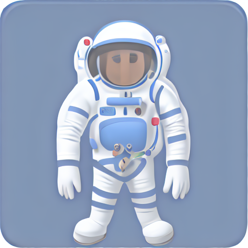

# Genmoji V2.0

[](https://www.python.org/)
[](https://pytorch.org/)
[](LICENSE)

Reproducción de Apple Intelligence Genmoji para la generación de emojis con estilo de Apple.  
Solo funciona con GPUs NVIDIA (sin soporte para CPU, no abran ningún Pull Request al respecto).  
Deberás agregar el argumento ``--train`` en la primera ejecución o descargar el modelo y colocarlo en la ruta ``model\``.  
### Información importante  
Este proyecto fue creado por [abgache](https://github.com/abgache), utilizando una computadora con Windows 11 y una GPU NVIDIA GeForce GTX 970 de 4 GB.

# ¿Cómo usarlo?  
## 1. Clonar el repositorio  
```
git clone https://github.com/abgache/Genmoji.git
```  
## 2. Descargar los requisitos  
```
cd genmoji
pip install -r requirements.txt
```  
## 3. Ejecutar main.py y agregar los argumentos necesarios  
```
python main.py
```  
### Argumentos  
``--train`` = para entrenar el modelo  
``--overwrite`` = si se agrega, el script regenerará los prompts de entrenamiento mejorados  
``--server`` = para activar la API local  
``--generate`` = para generar un GenMoji (``python main.py --generate "Flying pig"``)  
### Requisitos  
Necesitas tener descargado [Ollama](https://ollama.com/), con LLaMa3.1:8b descargado (Ollama debe estar ejecutándose en segundo plano mientras se ejecuta main.py).  
> Para descargar LLaMa (usando Ollama), ejecuta: ``ollama run llama3.1:8b``
Necesitarás cambiar la variable ``base_model_path`` en main.py por la ruta de ``diffusion_pytorch_model.safetensors`` ([descárgalo aquí](https://huggingface.co/stable-diffusion-v1-5/stable-diffusion-v1-5) y renómbralo) (obligatorio)  
y cambiar ``discord_webhook`` por TU webhook de [discord](https://discord.com/) (opcional).  
También necesitas tener [Python 3.10](https://www.python.org/downloads/release/python-3100/) o una versión más reciente (para crear este proyecto, usé Python 3.10.10) y todos los paquetes en ``requirements.txt``  

# Ejemplo de uso  
**Prompt:** ``An astronaut``  
**Prompt mejorado:** ``emoji of an astronaut wearing a white spacesuit with bright blue accents, a bold silver helmet, and a red oxygen tank on his back. cute. enlarged head in cartoon style. head is turned towards viewer. detailed texture. 3D lighting. no cast shadows.``  
**ID de generación:** ``833972797248``  
**Tiempo de generación:** ``7min 41s``  
**Resultado:**



# Descargo de responsabilidad / Aviso legal  

**Este proyecto es un proyecto de investigación independiente y no comercial, únicamente con fines educativos.**  
El modelo Genmoji es una versión ajustada de Stable Diffusion 1.5 utilizando LoRA, entrenada con conjuntos de datos de emojis disponibles públicamente.  
Todos los emojis incluidos en el conjunto de datos de entrenamiento son propiedad intelectual de sus respectivos propietarios (por ejemplo, Apple Inc.). Este proyecto **no** reclama la propiedad de ningún emoji ni material con derechos de autor. Ninguna parte de este proyecto está afiliada, respaldada ni patrocinada por Apple ni por ningún otro titular de derechos.  
El uso de este proyecto es bajo tu propio riesgo. El creador de este proyecto no asume ninguna responsabilidad por cualquier mal uso del contenido generado.  
Si algún titular de derechos de autor considera que este proyecto infringe sus derechos, por favor contacte directamente al creador para solicitar la retirada bajo la ley DMCA.
