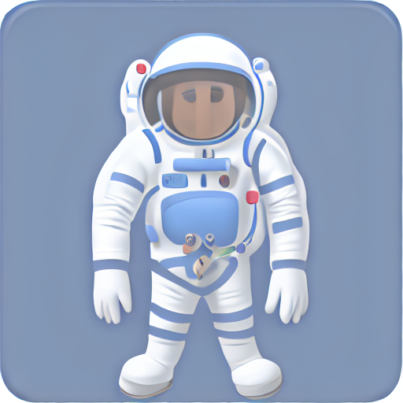

# Genmoji V2.0

[](https://www.python.org/)  
[](https://pytorch.org/)  
[](LICENSE)

Reproduction of Apple Intelligence Genmoji for apple style emoji generation.  
Only works with NVIDIA GPUs (no CPU support - do not open any Pull request about that)  
You'll need to add the ``--train`` argument in the 1st launch or download the model and add it in the ``model\`` path.  
### Important Informations  
This project was made by [abgache](https://github.com/abgache), using a Windows 11 computer, and an NVIDIA GeForce GTX 970 4gb GPU.

# How to use ?  
## 1st : Clone the repo  
```
git clone https://github.com/abgache/Genmoji.git
```  
## 2nd : download the requirements  
```
cd genmoji
pip install -r requirements.txt
```  
## 3rd : Start main.py and add the arguments you need  
```
python main.py
```  
### Arguments  
``--train`` = to train the model  
``--overwrite`` = if added, the script will regenerate the enhanced trainning prompts  
``--server`` = To activate the local API  
``--generate`` = To generate a GenMoji (``python main.py --generate "Flying pig"``)  
### Requirements  
You need to have [Ollama](https://ollama.com/) downloaded, with LLaMa3.1:8b downloaded (Ollama has to be running in the background while running main.py).  
> To download LLaMa (using Ollama), run : ``ollama run llama3.1:8b``
You'll need to change the ``base_model_path`` variable in main.py by the ``diffusion_pytorch_model.safetensors`` path ([download it here](https://huggingface.co/stable-diffusion-v1-5/stable-diffusion-v1-5) and rename it) (mandatory)  
and change the ``discord_webhook`` by YOUR [discord](https://discord.com/) webhook (optional).  
You also need to have [python 3.10](https://www.python.org/downloads/release/python-3100/) or newer (to create this project, I used python 3.10.10) and all the packages in ``requirements.txt``  

# Usage example  
**Prompt :** ``An astronaut``  
**Enhanced Prompt :** ``emoji of an astronaut wearing a white spacesuit with bright blue accents, a bold silver helmet, and a red oxygen tank on his back. cute. enlarged head in cartoon style. head is turned towards viewer. detailed texture. 3D lighting. no cast shadows.``  
**Generation ID :** ``833972797248``  
**Generation Time :** ``7min 41s``  
**Output :**



# Disclaimer / Legal Notice  

**This project is an independent, non-commercial research project for educational purposes only.**  
The Genmoji model is a fine-tuned version of Stable Diffusion 1.5 using LoRA trained on publicly available emoji datasets.  
All emojis included in the training dataset are the intellectual property of their respective owners (e.g., Apple Inc.). This project does **not** claim ownership of any emoji or copyrighted material. No part of this project is affiliated with, endorsed by, or sponsored by Apple or any other rights holder.  
Use of this project is at your own risk. The creator of this project assumes no liability for any misuse of the generated content.  
If any copyright holder believes that this project infringes their rights, please contact the creator directly for DMCA takedown requests.
